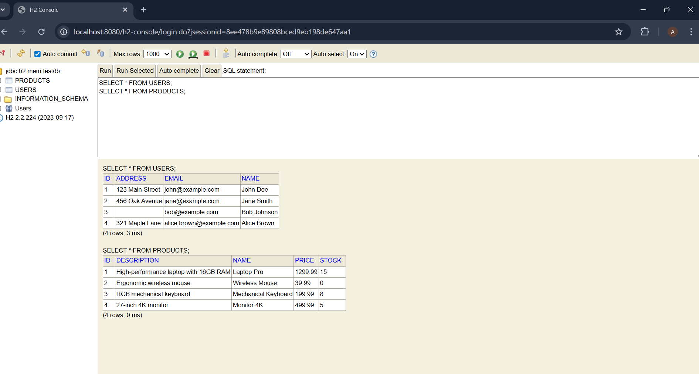
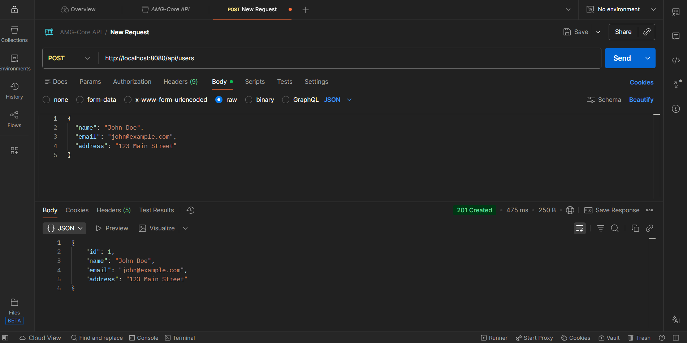
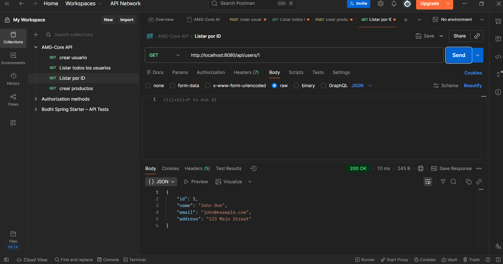
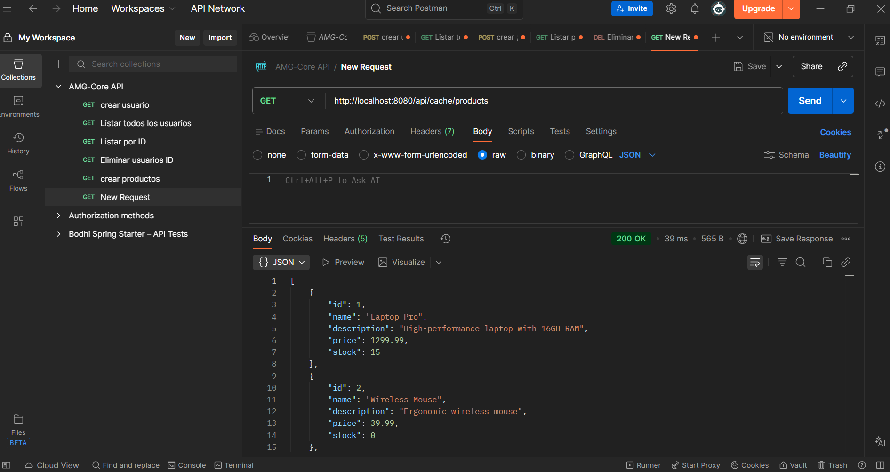
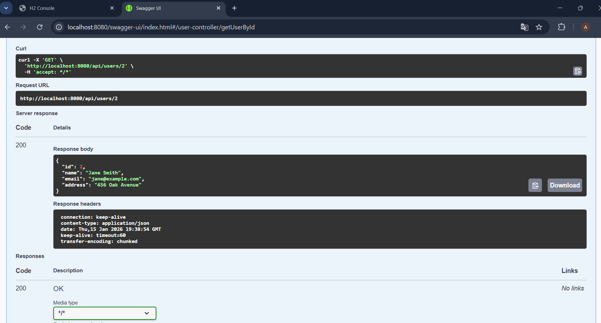

# AMG-Core

A production-ready Spring Boot microservice built with Java 21
that provides RESTful APIs for example entities (Users and Products) with H2 database.
The service is designed for deployment using Docker containers.

## Technology Stack

- **Java**: 21 (LTS)
- **Framework**: Spring Boot 3.2.7
- **Build Tool**: Gradle 8.8
- **Database**: H2 (in-memory)
- **ORM**: Spring Data JPA / Hibernate
- **Reactive**: Spring WebFlux
- **Caching**: Spring Cache (Simple Cache)
- **Retry**: Spring Retry (max 3 attempts)
- **Query**: JPA Specifications for dynamic queries
- **Container**: Docker (multi-stage build with Alpine Linux)
- **Testing**: JUnit 5, Mockito, Spring Boot Test
- **Documentation**: SpringDoc OpenAPI 3 (Swagger UI)
- **Monitoring**: Spring Boot Actuator

## Features

- RESTful APIs for example entities (Users and Products) with full CRUD operations
- H2 in-memory database with automatic schema generation
- Spring Cache with cacheable methods for improved performance
- Spring WebFlux reactive endpoints with reactive service layer
- Spring Retry configured with maximum 3 attempts across all profiles
- JPA Specifications for dynamic and complex queries
- Environment-based configuration (dev, staging, production)
- Comprehensive error handling with proper HTTP status codes
- Input validation using Jakarta Bean Validation
- Health check endpoints for monitoring
- Docker containerization with Docker Compose for easy deployment
- CI/CD ready with GitHub Actions support

## Architecture

The application follows a layered architecture pattern:

```
┌─────────────────────────────────────────┐
│         REST Controllers Layer          │
│  (UserController, ProductController,    │
│   ProductCacheController, etc.)         │
└─────────────────┬───────────────────────┘
                  │
┌─────────────────▼───────────────────────┐
│         Service Layer                    │
│  (ProductCacheService,                   │
│   ReactiveProductService,                │
│   ProductSpecificationService, etc.)     │
└─────────────────┬───────────────────────┘
                  │
┌─────────────────▼───────────────────────┐
│         Repository Layer                 │
│  (UserRepository, ProductRepository)    │
│  + JPA Specifications                    │
└─────────────────┬───────────────────────┘
                  │
┌─────────────────▼───────────────────────┐
│         Database Layer                   │
│  (H2 In-Memory Database)                │
└─────────────────────────────────────────┘
```

## Prerequisites

- **Java 21** (JDK) - LTS version
- **Docker** and **Docker Compose** (for containerized builds and deployment)
- **Gradle 8+** (optional, for local builds without Docker)

## Project Structure

```
AMG-Core/
├── src/
│   ├── main/
│   │   ├── java/com/acme/platform/
│   │   │   ├── api/                    # REST controllers
│   │   │   │   ├── exception/         # Global exception handler
│   │   │   │   ├── HealthController.java
│   │   │   │   ├── UserController.java
│   │   │   │   ├── ProductController.java
│   │   │   │   ├── ProductCacheController.java
│   │   │   │   ├── ReactiveProductController.java
│   │   │   │   ├── ProductSpecificationController.java
│   │   │   │   └── UserSpecificationController.java
│   │   │   ├── model/                  # JPA entities
│   │   │   │   ├── User.java
│   │   │   │   └── Product.java
│   │   │   ├── repository/             # JPA repositories
│   │   │   │   ├── UserRepository.java
│   │   │   │   └── ProductRepository.java
│   │   │   ├── service/                # Business logic
│   │   │   │   ├── ProductCacheService.java
│   │   │   │   ├── ReactiveProductService.java
│   │   │   │   ├── ProductSpecificationService.java
│   │   │   │   └── UserSpecificationService.java
│   │   │   ├── specification/          # JPA Specifications
│   │   │   │   ├── ProductSpecification.java
│   │   │   │   └── UserSpecification.java
│   │   │   └── Application.java        # Spring Boot entry point
│   │   └── resources/
│   │       ├── application.yml         # Base configuration
│   │       ├── application-dev.yml     # Development profile
│   │       ├── application-stg.yml     # Staging profile
│   │       └── application-prod.yml    # Production profile
│   └── test/                           # Unit tests
├── build.gradle                         # Gradle build configuration
├── Dockerfile                           # Multi-stage Docker build
├── docker-compose.yml                   # Docker Compose configuration
├── docs/
│   └── images/                          # Test evidence and screenshots
└── README.md
```

## Configuration

### Database

The application uses H2 in-memory database by default. The H2 console is available at `/h2-console` for database inspection.

- **Database URL**: `jdbc:h2:mem:testdb`
- **Username**: `sa`
- **Password**: (empty)
- **Schema**: Automatically created on startup using JPA `ddl-auto: update`

#### Using H2 Console

1. Start the application (see [Running the Application](#running-the-application))
2. Navigate to `http://localhost:8080/h2-console`
3. Enter connection details:
   - **JDBC URL**: `jdbc:h2:mem:testdb`
   - **Username**: `sa`
   - **Password**: (leave empty)
4. Click "Connect"

Once connected, you can execute SQL queries to inspect and manage the database:

```sql
-- View all users
SELECT * FROM USERS;

-- View all products
SELECT * FROM PRODUCTS;

-- View table structure
SHOW TABLES;
```

**Expected Behavior:**
- Tables are automatically created when the application starts
- Data persists during the application session
- Data is lost when the application restarts (in-memory database)
- The console shows query results in a tabular format



### Spring Profiles

The application supports three environment profiles:

- **dev**: Development environment
- **stg**: Staging environment
- **prod**: Production environment

Each profile can override default configuration values. Profile-specific settings are defined in `application-{profile}.yml` files.

### Retry Configuration

The application uses Spring Retry for automatic retry of failed operations:

- **Max Attempts**: 3 (configured in all profiles)
- **Backoff Delay**: 1000ms between retries
- **Enabled**: `@EnableRetry` annotation in Application class

Retry is applied to services using `@Retryable` annotation, particularly in `ProductSpecificationService` and `UserSpecificationService`.

### Cache Configuration

Spring Cache is configured with simple in-memory cache:

- **Cache Type**: Simple (in-memory)
- **Cache Names**: `products`, `users`, `productStats`
- **Annotations**: 
  - `@Cacheable`: Caches method results
  - `@CachePut`: Updates cache when saving
  - `@CacheEvict`: Clears cache when deleting

Cache keys follow the pattern: `{cacheName}::{key}` (e.g., `products::1`, `products::all`)

### WebFlux Configuration

The application uses Spring WebFlux for reactive programming:

- **Reactive Service Layer**: `ReactiveProductService` wraps blocking JPA operations in reactive streams
- **Scheduler**: Uses `Schedulers.boundedElastic()` for blocking database operations
- **Types**: 
  - `Mono<T>`: Represents 0 or 1 result
  - `Flux<T>`: Represents 0 to N results (stream)
- **Benefits**: Non-blocking operations, better resource utilization, backpressure handling

## Running the Application

### Using Docker Compose (Recommended)

```bash
# Start the application
docker-compose up -d

# View logs
docker-compose logs -f

# Stop the application
docker-compose down
```

The application will be available at `http://localhost:8080`.

### Local Development

**Note**: For local development, it's recommended to use Docker Compose as shown above. If you need to run without Docker:

**Windows (PowerShell):**
```powershell
$env:SPRING_PROFILES_ACTIVE="dev"
.\gradlew.bat clean bootRun
```

**Linux/Mac (Bash):**
```bash
export SPRING_PROFILES_ACTIVE=dev
./gradlew clean bootRun
```

**Note**: Make sure Docker Desktop is running if using the Docker Compose approach, which is the recommended method.

### Running Tests

```bash
# Run all tests
./gradlew test

# Windows PowerShell
.\gradlew test

# Linux/Mac
./gradlew test
```

**Test Coverage:**
- `ApplicationTest`: Verifies Spring context loads successfully
- `HealthControllerTest`: Tests health check endpoint
- Additional tests can be added following the same pattern

## Testing Examples

### Using Postman

The following examples demonstrate how to test the API endpoints using Postman or similar API clients.

#### Creating a User (POST)

**Endpoint**: `POST http://localhost:8080/api/users`

**Request Body:**
```json
{
  "name": "John Doe",
  "email": "john@example.com",
  "address": "123 Main Street"
}
```

**Expected Response** (201 Created):



#### Getting a User by ID (GET)

**Endpoint**: `GET http://localhost:8080/api/users/1`

**Expected Response** (200 OK):




#### Getting Products with Cache (GET)

**Endpoint**: `GET http://localhost:8080/api/cache/products`

**Expected Response** (200 OK):




**Note**: The first call will hit the database, subsequent calls will use the cache for improved performance.

## API Documentation

### Swagger UI

Interactive API documentation is available at:
- **URL**: `http://localhost:8080/swagger-ui.html`




Swagger UI provides:
- Complete API documentation for all endpoints
- Interactive testing capabilities directly from the browser
- Request/response examples
- Schema definitions for all models
- Try-it-out functionality to test endpoints without external tools

**How to Use:**
1. Navigate to `http://localhost:8080/swagger-ui.html`
2. Browse available endpoints organized by controller
3. Click on any endpoint to expand details
4. Click "Try it out" to test the endpoint
5. Fill in parameters and request body (if needed)
6. Click "Execute" to send the request
7. View the response with status code, headers, and body

### H2 Console

Database management console:
- **URL**: `http://localhost:8080/h2-console`
- **JDBC URL**: `jdbc:h2:mem:testdb`
- **Username**: `sa`
- **Password**: (empty)

## API Endpoints

### Health Check

- **GET** `/healthz` - Simple health check (returns `"ok"`)
- **GET** `/actuator/health` - Spring Boot Actuator health endpoint

### User Management

| Method | Endpoint | Description |
|--------|----------|-------------|
| GET | `/api/users` | Get all users |
| GET | `/api/users/{id}` | Get user by ID |
| POST | `/api/users` | Create a new user |
| PUT | `/api/users/{id}` | Update an existing user |
| DELETE | `/api/users/{id}` | Delete a user |

**Request Body Example (POST/PUT):**
```json
{
  "name": "John Doe",
  "email": "john@example.com",
  "address": "123 Main St"
}
```

### Product Management

| Method | Endpoint | Description |
|--------|----------|-------------|
| GET | `/api/products` | Get all products (optional `?name={name}` filter) |
| GET | `/api/products/{id}` | Get product by ID |
| POST | `/api/products` | Create a new product |
| PUT | `/api/products/{id}` | Update an existing product |
| DELETE | `/api/products/{id}` | Delete a product |

**Request Body Example (POST/PUT):**
```json
{
  "name": "Laptop",
  "description": "High-performance laptop",
  "price": 999.99,
  "stock": 10
}
```

### Product Management with Cache

| Method | Endpoint | Description |
|--------|----------|-------------|
| GET | `/api/cache/products` | Get all products (cached) |
| GET | `/api/cache/products/{id}` | Get product by ID (cached) |
| GET | `/api/cache/products/search?name={name}` | Search products by name (cached) |
| POST | `/api/cache/products` | Create a new product (updates cache) |
| DELETE | `/api/cache/products/{id}` | Delete a product (clears cache) |
| GET | `/api/cache/products/stats/total-value` | Calculate total inventory value (cached) |
| GET | `/api/cache/products/stats/count` | Get product count (cached) |
| POST | `/api/cache/products/cache/clear` | Manually clear all product caches |

**Cache Behavior:**
- First call: Executes method and stores result in cache
- Subsequent calls: Returns cached value (no method execution)
- Cache eviction: Automatically cleared on delete/update operations

### Reactive Product Endpoints (WebFlux)

| Method | Endpoint | Description |
|--------|----------|-------------|
| GET | `/api/reactive/products` | Get all products reactively (NDJSON stream) |
| GET | `/api/reactive/products/{id}` | Get product by ID reactively |
| GET | `/api/reactive/products/search?name={name}` | Search products by name reactively |
| POST | `/api/reactive/products` | Create a new product reactively |
| PUT | `/api/reactive/products/{id}` | Update a product reactively |
| DELETE | `/api/reactive/products/{id}` | Delete a product reactively |
| GET | `/api/reactive/products/count` | Get total product count reactively |
| GET | `/api/reactive/products/stream?delaySeconds={seconds}` | Stream products with Server-Sent Events |

**WebFlux Benefits:**
- Non-blocking operations for better concurrency
- Reactive streams with backpressure support
- Efficient resource utilization
- Server-Sent Events for real-time streaming

### JPA Specifications Endpoints

#### Product Specifications

| Method | Endpoint | Description |
|--------|----------|-------------|
| GET | `/api/spec/products/search` | Search with filters (`name`, `minPrice`, `maxPrice`, `minStock`) |
| GET | `/api/spec/products/in-stock` | Get all products in stock |
| GET | `/api/spec/products/out-of-stock` | Get all products out of stock |
| GET | `/api/spec/products/price-range` | Get products within price range (`minPrice`, `maxPrice`) |
| GET | `/api/spec/products/description?description={text}` | Get products by description containing text |

#### User Specifications

| Method | Endpoint | Description |
|--------|----------|-------------|
| GET | `/api/spec/users/search` | Search with filters (`name`, `email`, `address`) |
| GET | `/api/spec/users/with-address` | Get all users with address |
| GET | `/api/spec/users/without-address` | Get all users without address |

**Note**: All specification endpoints use retry (max 3 attempts).

## Error Handling

The application includes comprehensive error handling:

- **400 Bad Request**: Invalid input parameters or validation failures
- **404 Not Found**: Resource does not exist
- **409 Conflict**: Resource conflict (e.g., duplicate email)
- **500 Internal Server Error**: Unexpected errors

Error responses follow this format:
```json
{
  "error": "Error type",
  "message": "Human-readable error message"
}
```

## Building and Packaging

### Build JAR

```bash
./gradlew clean bootJar
```

The executable JAR will be created in `build/libs/AMG-Core-0.0.1.jar`

### Build Docker Image

```bash
docker build -t amg-core:0.0.1 .
```

The Dockerfile uses a multi-stage build with Alpine Linux for minimal image size.

## CI/CD

The project includes a GitHub Actions workflow (`.github/workflows/ci-cd.yml`) that:

1. Runs tests on every push and pull request
2. Builds the Docker image

## Monitoring

The application exposes Spring Boot Actuator endpoints:

- `/actuator/health` - Health status
- `/actuator/info` - Application information
- `/actuator/metrics` - Application metrics
- `/actuator/prometheus` - Prometheus metrics format

## License

Proprietary. Internal use only.
